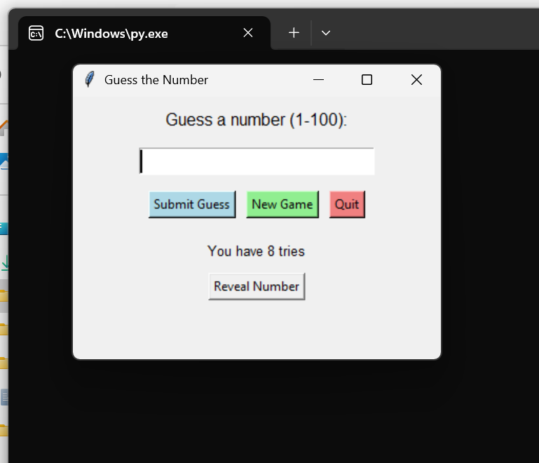

 # Number Guessing Game 🎯
A Python number guessing game with limited attempts and smart hints
A simple yet engaging Python number guessing game where the player has limited attempts to guess a randomly generated number.

## Features

- **Random Number Generation**: Game selects a random number between 1-100
- **Limited Attempts**: Player gets only 8 tries to guess correctly(trials ought to be 7 or 8)
- **Smart Hints**: Get "Too small!" or "Too large!" feedback after each wrong guess *remove too
- **Win/Loss Tracking**: Game tracks your attempts and informs you of victory or failure
- **User-Friendly**: Clear prompts and messages throughout the gameplay

## How to Play

1. Run the game script
2. Enter a number between 1 and 100 when prompted
3. Receive hints if your guess is too small or too large
4. You have 8 attempts to guess the correct number
5. Win by guessing correctly within the limit, or lose by running out of tries!

# Working on these improvements

1.Score tracking, best score

2. Hints, guess history

3. Input Validation

4, Better organization

5. Visual Range Indicator

6.Different celebrations for different performance levels
7.Better Visual Design 

## Installation & Usage

```bash
# Clone the repository
git clone https://github.com/your-bigben770/Number Guessing Game.git

# Navigate to the directory
cd number-guessing-game

# Run the game
python number_guessing_game.py
